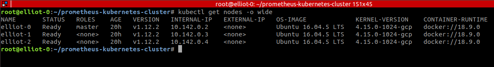

## K8s and Prometheus cluster deployment

This repository shows how to deploy an application in a kubernetes cluster, to be monitored by Prometheus, which will be installed in the cluster as well.

The deployed application will be Grafana, which already exposes metrics in Prometheus format.

Grafana demo url: http://35.196.26.65:30003

Prometheus demo url: http://35.196.26.65:30009
### Cluster setup

Install docker, kubectl, kubelet and kubeadm on hosts machines:

```sh
apt udpate
curl -fsSL https://get.docker.com | bash
curl -s https://packages.cloud.google.com/apt/doc/apt-key.gpg | apt-key add -
echo "deb http://apt.kubernetes.io/ kubernetes-xenial main" > /etc/apt/sources.list.d/kubernetes.list
apt update && apt install -y kubelet kubeadm kubectl
```

Init kubernetes cluster on master host:

```sh
echo "source <(kubectl completion bash)" >> ~/.bashrc
kubeadm init --apiserver-advertise-address=$(hostname -i) --ignore-preflight-errors=SystemVerification
mkdir -p $HOME/.kube
cp -i /etc/kubernetes/admin.conf $HOME/.kube/config
chown $(id -u):$(id -g) $HOME/.kube/config
```
Note: ignore system verification means bypassing kubernetes warning about using the newest version of docker

Join cluster on other nodes:

```sh
kubeadm join <MASTER_IP_ADDRESS>:<PORT> --token <TOKEN> --discovery-token-ca-cert-hash <HASH> --ignore-preflight-errors=SystemVerification
```

Init network addon (wavenet) on master host:

```sh
kubectl apply -f "https://cloud.weave.works/k8s/net?k8s-version=$(kubectl version | base64 | tr -d '\n')"
```

### Deployment 

List available nodes:

```sh
kubectl get nodes -o wide
```


Create configuration map required to mount prometheus volume:

```sh
kubectl create -f configmap.yml
```

Create kubernetes deployment from configuration file:

```sh
kubectl create -f deploy.yml
```

List created deployments:

```sh
kubectl get deployments -o wide
```


Create a service to manage incoming requests:

```sh
kubectl create -f service.yml
```

List created services:

```sh
kubectl get services -o wide
```


List all created resources:

```sh
kubectl get all -o wide
```


### References

[Linux Tips](https://www.youtube.com/watch?v=pV0nkr61XP8)

[IBM FSS FCI and Counter Fraud Management](https://www.youtube.com/watch?v=VB7vI9OT-WQ)

[Kubernetes Interactive Tutorial](https://kubernetes.io/docs/tutorials/hello-minikube/)

[DevOps Cube](https://devopscube.com/setup-prometheus-monitoring-on-kubernetes/)